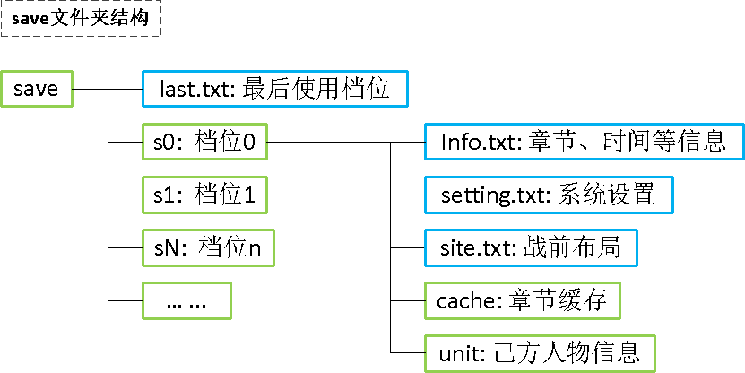
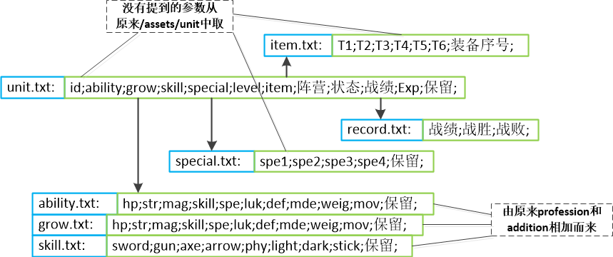

# save: 存档管理文件夹

## save/num.txt : 存档槽数量

* 说明: 文件就2个数字nn
* 示例:  03

## save/last.txt : 最后存档位置

* 说明: 文件就2个数字nn
* 示例:  00

# save/sX : 存档X文件夹

## save/sX/info.txt : 存档章节信息

* 关于是否中断: 0/加载存档时重新开始章节 1/恢复中断状态
* 示例:  章节;是否中断;总耗时;

## save/sX/setting.txt : 系统设置

* 格式:
* 示例:

## save/sX/site.txt : 当前章节己方人物站位(初始值从sectionXX/site.txt拷贝过来)

* 格式: 每行代表一个位置
* 关于固定位置: 只有指定的人物ID的人可以站位, 0/任意人
* 关于人物ID: 默认站在这里的人物ID, 0表示未指定
* 示例: 触发方式;出现回合;XY位置;固定位置;人物ID;
* 0;0;010010;0;0;

## save文件结构总览

# save/sX/unit : 己方人物信息文件夹,随剧情推进不断增加人物

## save/sX/unit/unit.txt : 人物列表

* 说明: 从/assets/unit/unit.txt拷贝而来, 其中增量和物品改用本文件夹参数
* 关于状态: 0/正常 1/die
* 示例: 人物id;能力;成长;技能等级;个人特技;等级;物品;阵营(0~6);状态;战绩;exp;保留;

## save/sX/unit/grow.txt : 职业能力列表

* 格式: 每行代表一个职业的成长率,从0行数起
* 示例: HP;力量;魔力;技术;速度;幸运;防御;魔防;体格;移动;
* 60;45;0;50;55;60;35;40;0;0;
* 80;55;0;40;35;40;60;20;0;0;

## save/sX/unit/skill.txt : 基本技能列表

* 格式: 每行代表一个人物的基本技能,从0行数起
* 1.每行格式: 剑;枪;斧;弓;光;理;暗;仗;
* 2.数值: 0表示禁止该技能; >=0表示该技能熟练度
* 3.数值范围: 见skill_level.txt
* 示例: 
* 20;1;0;0;0;0;0;0;
* 1;20;0;0;0;0;0;0;

## save/sX/unit/special.txt : 个人特技列表

* 格式: 每行代表一个人物拥有的特技,从0行数起,每行4个
* 示例: 0表示没有装载,前面2个槽为职业特技
* 1;2;0;0;
* 1;0;0;0;

## save/sX/unit/item.txt : 人物物品栏

* 格式: 每行代表一个人物拥有的6个物品
* 示例: T1(0表示没有);T2;T3;T4;T5;T6;当前装备序号(0~5);
* 1;2;0;0;0;1;
* 1;0;0;0;0;0;

## save/sX/unit/record.txt : 人物战绩

* 格式: 每行代表一个人物的历史战绩
* 示例: 战绩;战胜;战败;
* 1;1;0;
* 1;0;0;

## save/sX/unit文件结构总览

# save/sX/cache : 章节系统缓存信息

## save/sX/cache/round.txt : 当前回合、行动阵营、章节时间

* 关于序号: 人物载入地图时的序号, 可用来匹配人物参数 camp_c_xxx.txt 及行动顺序
* 示例: 回合;阵营;人物序号;章节运行时长;

## save/sX/cache/unit.txt : 全图人物状态

* 说明: 一行代表一个人物
* 关于失能标记: 0/正常, 1/该行作废
* 示例: 失能标记;阵营;人物序号;人物id;XY坐标;

## save/sX/cache/camp_c_xxx.txt : 人物参数, c为阵营, xxx为上面提到的人物序号

* 关于状态: 0/正常 1/中毒 2/睡眠 3/沉默 4/狂乱 5/无敌 444/死亡
* 关于救出状态: 0/无 1/救出 2/被救起
* 关于视野: 战争迷雾场地人物周边可视范围,不同职业不同,使用火把后有加成
* 格式:
* 行0: 是否待机;状态;level;exp;剩余hp;
* 行1: HP;力量;魔力;技术;速度;幸运;防御;魔防;体格;移动;
* 行2: HP;力量;魔力;技术;速度;幸运;防御;魔防;体格;移动; //add 加成
* 行3: 剑;枪;斧;弓;光;理;暗;仗熟练度;
* 行4: T1;T2;T3;T4;T5;T6;当前装备;
* 行5: S1;S2;S3;S4;
* 行6: 救出状态;救/被救起者序号;
* 行7: 战绩;战胜;战败;
* 行8: 视野;道具加成视野;
