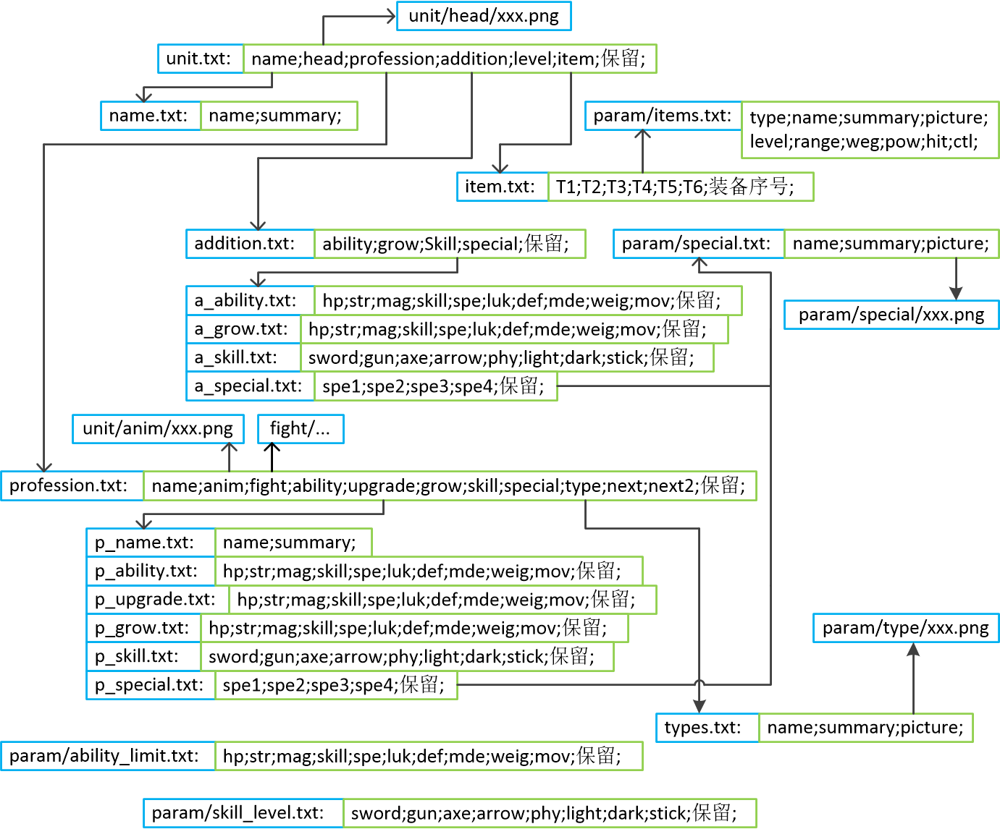

# unit文件夹文件说明

## unit.txt : 单元描述文件

* 格式: 每个单元人物由多种信息拼凑而成,这里一行描述一个人物
* 示例: 名称;头像;职业;增量;等级;物品;保留;

## name.txt : 人物名称列表

* 格式: 每行代表一个名称,从0行数起
* 示例: 名称;简介;
* 艾利乌德;菲雷侯公子,十分认真,正义感很强;
* 赫克托尔;奥斯迪亚侯弟弟,虽然鲁莽,但很关心亲友;

## profession.txt : 职业描述文件

* 格式: 每个职业由多种信息拼凑而成,这里一行描述一个人物
* 示例: name;anim;fight,ability;upgrade;grow;skill;special;type;下一职业(不能再转填自己);下一职业2;保留;

## p_name.txt : 职业名称列表

* 格式: 每行代表一个职业名称,从0行数起
* 示例: 名称;简介;
* 领主骑士;拥有君主资质的人才被赋予的称号,驾马驰骋在战场上的利西亚骑士;
* 重装领主;拥有君主资质的人才被赋予的称号,挥舞着斧与剑的猛将;

## p_ability.txt : 基本能力列表

* 格式: 每行代表一个人物的基本能力,从0行数起
* 示例: HP;力量;魔力;技术;速度;幸运;防御;魔防;体格;移动;
* 21;5;0;5;7;5;3;3;9;5;
* 25;7;0;5;4;5;9;0;13;5;

## p_ability_name.txt : 基本能力简介列表

* 格式: 每行代表一个能力简介,从0行数起
* 示例: 名称;简介;
* HP;人物现阶段的HP,为0的话人物便会死亡;
* 力量;人物的力量强度,给予敌人的伤害;

## p_grow.txt : 职业能力成长率列表

* 格式: 每行代表一个职业的成长率,从0行数起
* 示例: HP;力量;魔力;技术;速度;幸运;防御;魔防;体格;移动;总量;保留;
* 90;50;00;55;55;30;35;25;00;00;340;yongbin;
* 80;45;00;60;55;35;35;35;00;00;345;yongbinnv;

## p_upgrade.txt : 基本能力升级加点列表

* 格式: 每行代表一个基本能力升级加点,从0行数起
* 示例: HP;力量;魔力;技术;速度;幸运;防御;魔防;体格;移动;;总量;保留;

## p_skill.txt : 基本技能列表

* 格式: 每行代表一个人物的基本技能,从0行数起
* 1.每行格式: 剑;枪;斧;弓;光;理;暗;仗;
* 2.数值: 0表示禁止该技能; >=0表示该技能熟练度
* 3.数值范围: 见skill_level.txt
* 示例: 
* 20;1;0;0;0;0;0;0;
* 1;20;0;0;0;0;0;0;

## p_special.txt : 职业特技列表

* 格式: 每行代表一个职业拥有的特技,从0行数起,每行2个
* 示例: 0表示没有装载,前面2个槽为职业特技
* 2;1;
* 1;0;

## addition.txt : 人物能力加成文件

* 1.通过加成或减低参数来凸显每个角色的不同
* 2.每行填写: ability;grow;skill;special;;等信息的序号(从0数起)

## a_ability.txt : 人物基本能力修正列表

* 格式: 每行代表一个人物的基本能力,从0行数起
* 示例: HP;力量;魔力;技术;速度;幸运;防御;魔防;体格;移动;
* -5;5;0;0;0;5;1;-1;0;0;
* 5;-5;0;0;0;5;1;2;0;0;

## a_grow.txt : 人物能力成长率加成列表

* 格式: 每行代表一个人物能力成长率加成,从0行数起
* 示例: HP;力量;魔力;技术;速度;幸运;防御;魔防;体格;移动;
* 00;10;0;0;0;0;0;10;0;0;
* 10;10;0;0;0;0;0;-10;0;0;

## a_skill.txt : 基本技能加成列表

* 格式: 每行代表一个人物的基本技能,从0行数起
* 每行格式: 剑;枪;斧;弓;光;理;暗;仗;
* 示例: 
* 10;10;0;0;0;0;0;0;
* -5;-5;0;0;0;0;0;0;

## a_special.txt : 人物特技列表

* 格式: 每行代表一个人物拥有的特技,从0行数起,每行4个
* 示例: 0表示没有装载,前面2个槽为职业特技
* 1;2;0;0;
* 1;0;0;0;

## item.txt : 人物物品栏

* 格式: 每行代表一个人物拥有的6个物品
* 示例: T1(0表示没有);T2;T3;T4;T5;T6;当前装备序号(0~5);
* 1;2;0;0;0;1;
* 1;0;0;0;0;0;

## head/xxx.png : 头像文件

* 格式: 名称即为序号,从000.png到999.png

## anim/xxx.png : 地图动画文件

* 格式: 名称即为序号,从000.png到999.png

# 文件结构总览

